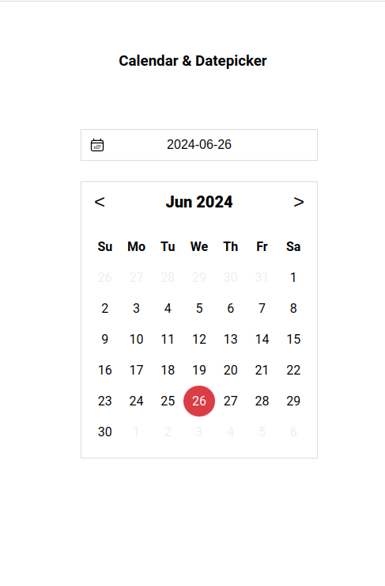
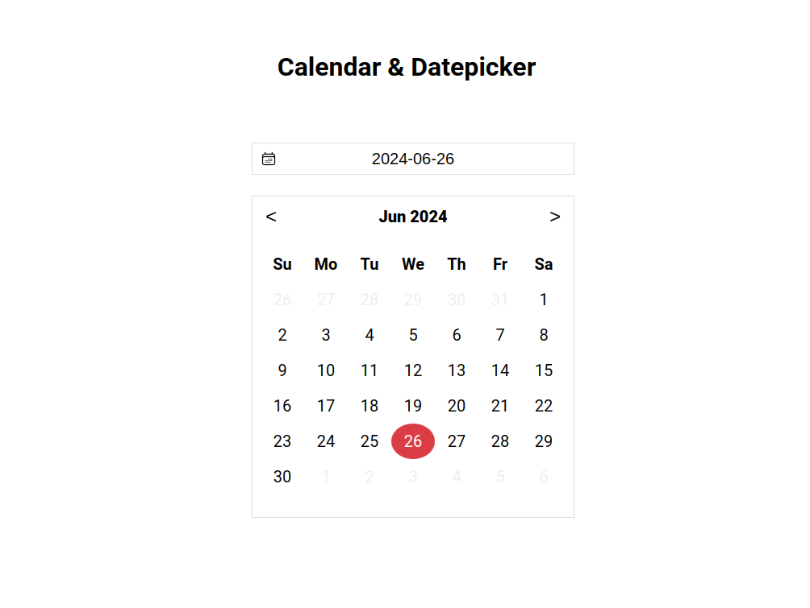

# Calendar and Datepicker

This project implements a calendar and datepicker component using React. It provides functionalities for selecting dates and navigating through months.

## Usage

After installing dependencies, you can run the project locally using the provided scripts.

```bash
npm run dev
```

This command starts the development server using Vite, allowing you to preview the calendar and datepicker component in your browser.

## Screenshots




